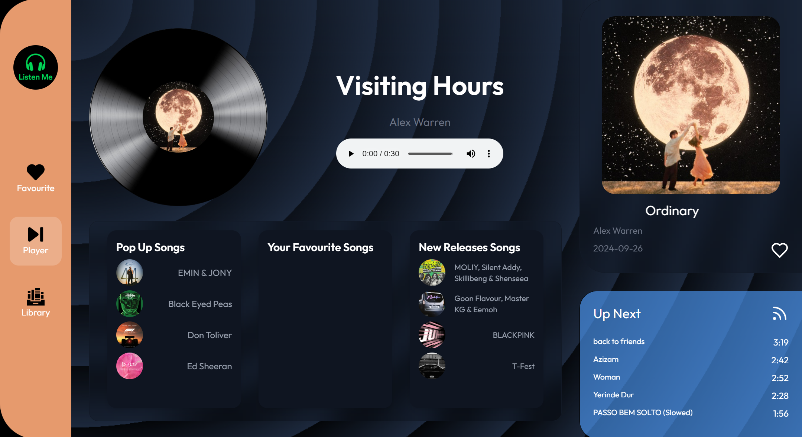
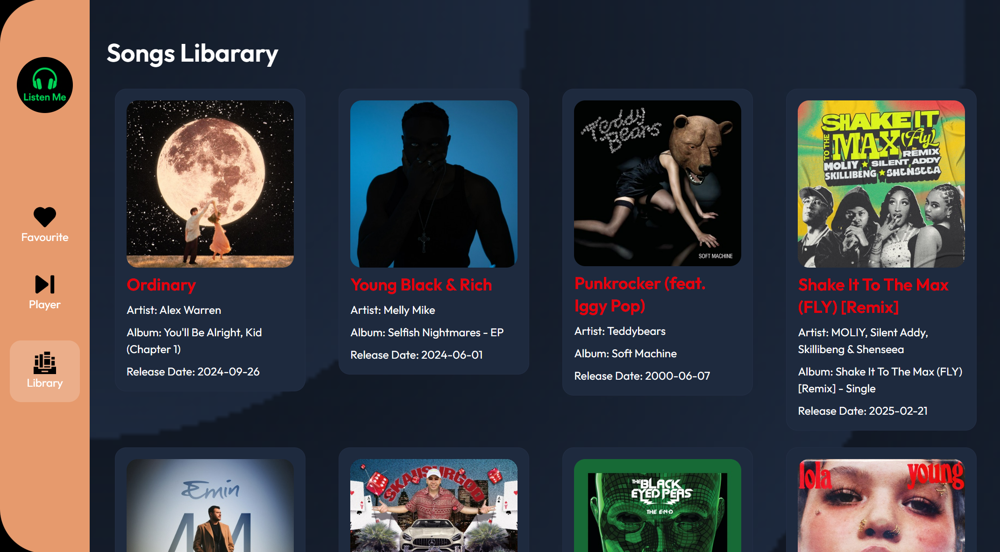
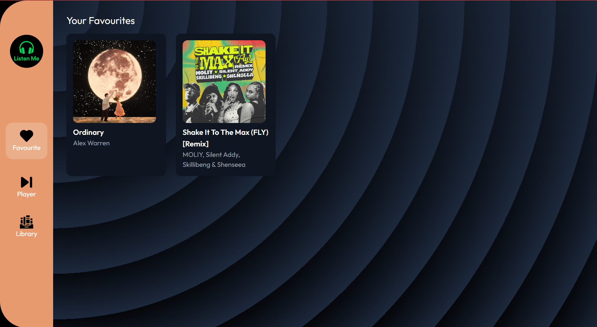

# 🎧 Listen Me

A modern, Spotify-inspired music web app built using **React**, **Tailwind CSS**, and **Spotify API**.  
It allows users to explore songs, play previews, view song details, and add them to a favourites list — all in a smooth, responsive UI.And Using a Rapid Api 

📦 Deployment
----------------------------------------------------------------------------------------
Deployed using Vercel

👉 Live URL: https://listenme.vercel.app (replace with your link)

## 🌟 Features
-------------------------------------------------------------------------------------

- 🎵 **Music Player** – Play and preview tracks with animated visual feedback.
- ❤️ **Add to Favourites** – Save your favourite songs globally.
- 🔍 **Search & Browse** – Discover new releases and popular tracks.
- 🧭 **Smooth Navigation** – React Router-based seamless routing.
- 📱 **Responsive Design** – Mobile-optimized sidebar and layout with slide-down animation.
- ⚙️ **Spotify Integration** – Uses Spotify (or Shazam) API to fetch song data.
- 💚 **Modern UI** – Glassmorphism, Tailwind CSS, and elegant card layouts.

## 🖥️ Tech Stack

- **Frontend:** React, Tailwind CSS, React Router
- **API:** Spotify API / Shazam Core API (via RapidAPI)
- **Icons:** Lucide React, Custom PNG Assets
- **State Management:** React Context API for Favourites

## 📁 Folder Structure
ListenMe/
│
├── public/
│ └── index.html
├── src/
│ ├── assets/ # Icons and images
│ ├── Components/
│ │ ├── Sidebar.jsx
│ │ ├── MusicData.jsx
│ │ ├── FavouritesContext.js
│ │ └── ReactPlayerAudio.jsx
│ ├── Pages/
│ │ ├── Favourites.jsx
│ │ ├── Library.jsx
│ │ └── Home.jsx
│ ├── App.jsx
│ └── main.jsx
├── .gitignore
├── README.md
└── package.json

📸 Screenshots
----------------------------------------------------------------------------------
####  Player

#### Songs Lists

#### 🎟Favourites

🧠 Learnings
---------------------------------------------------------------------------------------

During this project I learned:

Spotify API integration & OAuth flow

Responsive UI with Tailwind

Context API for global state (favourites)

React Router for page transitions

Handling dynamic routing with state transfer

## 🚀 Getting Started
---------------------------------------------------------------------------------------

### 1. Clone the repository

git clone https://github.com/your-username/ListenMe.git
cd ListenMe

### 2. Install dependencies

npm install

### 3. Start the development server
npm run dev

👨‍💻 Author
--------------------------------------------------------------------------------------
Rahul Pal
🔗 GitHub
